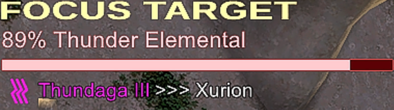

# FFXI Focus Target

A Windower 4 addon that allows you to focus a target in a similar fashion to Final Fantasy XIV. It tracks HP, claim status and casting of spells on a target.




## Commands

### //ft

Toggles the focus on the current target. If there is no target, any existing focus is removed.

It can be helpful to setup a bind for this. To match the ALT+F bind from FFXIV:

```
bind !f ft
```

### //ft pos <x> <y>

Set the position on either the x or y axis.

Example: `//ft pos y 200`

Simply running `//ft pos` will report the current x and y position.

### //ft help

Displays command help.

## Development

Any and all planned features and enhancements are over on the [General board](https://github.com/xurion/ffxi-focus-target/projects/1). Feel free to raise any issues or suggestions in the [issue tracker](https://github.com/xurion/ffxi-focus-target/issues). Pull requests are also welcome!
